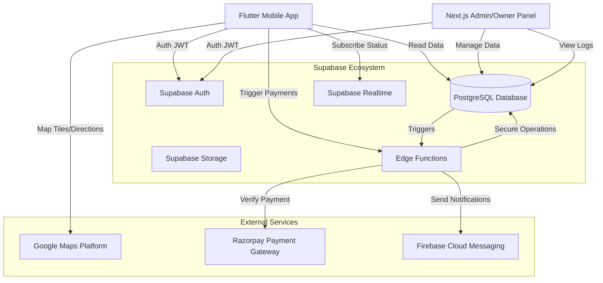

# System Architecture

## High-Level System Architecture

The platform architecture follows a serverless, scalable approach utilizing Supabase as the backend-as-a-service (BaaS) and Flutter for the client-side mobile application.

## Data Flow

### 1. User & Authentication
- **User** signs up/logs in via OTP (Twilio/Supabase) or Google Auth.
- **Supabase Auth** issues a JWT Access Token.
- All subsequent requests to Database or Edge Functions include this JWT.
- **Row Level Security (RLS)** policies in PostgreSQL enforce access control based on `auth.uid()`.

### 2. Charger Discovery & Navigation
- **App** requests charging stations within a geo-bounding box from PostgreSQL (PostGIS).
- **Google Maps SDK** renders markers.
- **App** subscribes to `charger_status` table changes via Supabase Realtime for visible markers to show live Availability (Green/Red).

### 3. Payment Flow (Razorpay)
1.  **User** initiates charging session -> Calls Edge Function `create-payment-order`.
2.  **Edge Function** calls Razorpay API -> returns `order_id`.
3.  **App** opens Razorpay Checkout -> User completes payment.
4.  **Razorpay** sends webhook to Edge Function `handle-webhook`.
5.  **Edge Function** validates signature -> updates `transactions` table -> triggers `start_charging` logic.

### 4. Admin & Charger Owner Management
- **Owners** register chargers via Admin Panel -> `charging_stations` table (Status: Pending).
- **Admin** reviews submission -> Updates status to `Active`.
- **Owners** view earnings dashboard -> Aggregated queries on `transactions` table.

## Technology Decisions
- **Supabase**: Chosen for built-in Realtime, Auth, and PostGIS support, eliminating the need for a separate Websocket server and complex backend.
- **Edge Functions**: Used for sensitive logic (Payments) to avoid exposing API keys in the client app.
- **Flutter**: Single codebase for Android/iOS with excellent Google Maps and Razorpay SDK support.
