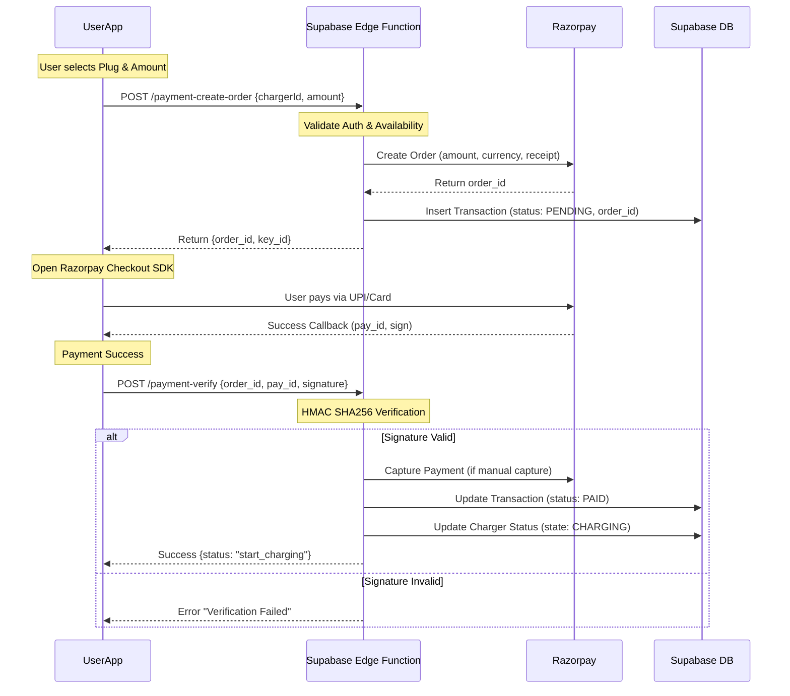

# Razorpay Payment Flow

This document outlines the secure payment flow for EV charging sessions using Razorpay and Supabase Edge Functions.

## 1. Sequence Diagram

## 2. Edge Functions

### `payment-create-order`
- **Auth**: Required (`auth.uid()`)
- **Inputs**: `charger_id`, `amount` (INR)
- **Logic**:
  1. Check if `charger_status` is `AVAILABLE`.
  2. Calculate amount in paisa (INR * 100).
  3. Call Razorpay API `orders.create`.
  4. Create `transactions` record with `payment_provider_id = order_id`.
- **Output**: `order_id`, `currency`, `key_id` (env var).

### `payment-webhook` (Optional / Fallback)
- **Auth**: None (Validate Webhook Secret)
- **Trigger**: `payment.captured` or `payment.failed` event from Razorpay.
- **Logic**:
  1. Verify `X-Razorpay-Signature`.
  2. Find transaction by `order_id`.
  3. Update status to `PAID` or `FAILED`.
  4. If `PAID` and charger not yet started, trigger start.
  
## 3. Security Measures
- **Never** store Razorpay `key_secret` in the mobile app.
- **Always** verify payment signature on the server (Edge Function).
- **Idempotency**: Ensure multiple webhook events don't trigger double charging (check if transaction is already `PAID`).
